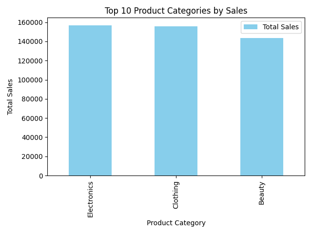

# Spark Data Analysis 101

Welcome to the Spark Data Analysis 101 project!
This project is minimal setup for getting started with data analysis using [Apache Spark](https://spark.apache.org/).

## Project Description

This project provides a basic setup for performing data analysis using Spark. It includes clean dependencies and configurations to get you up and running quickly.

## Requirements

- [uv](https://docs.astral.sh/uv/getting-started/installation/)
- [Docker Compose](https://docs.docker.com/compose/install/)

## Installation

1. Clone the repository:
    ```sh
    git clone https://github.com/yourusername/spark-data-analysis-101.git
    cd spark-data-analysis-101
    ```
2. Download the dataset: [Retail Sales Dataset](https://www.kaggle.com/datasets/mohammadtalib786/retail-sales-dataset)
    ```sh
    ./download-dataset.sh
    ```
3. Start the Spark cluster:
    ```sh
    docker-compose up -d
    ```
4. Create python virtual environment and install the dependencies:
    ```sh
    uv venv
    uv install
    ```

## Usage

Run the main script:
```sh
uv run python main.py
```

Should see the following output:
```
+--------------+----------+-----------+------+---+----------------+--------+--------------+------------+
|Transaction ID|      Date|Customer ID|Gender|Age|Product Category|Quantity|Price per Unit|Total Amount|
+--------------+----------+-----------+------+---+----------------+--------+--------------+------------+
|             1|2023-11-24|    CUST001|  Male| 34|          Beauty|       3|            50|         150|
|             2|2023-02-27|    CUST002|Female| 26|        Clothing|       2|           500|        1000|
|             3|2023-01-13|    CUST003|  Male| 50|     Electronics|       1|            30|          30|
|             4|2023-05-21|    CUST004|  Male| 37|        Clothing|       1|           500|         500|
|             5|2023-05-06|    CUST005|  Male| 30|          Beauty|       2|            50|         100|
+--------------+----------+-----------+------+---+----------------+--------+--------------+------------+
only showing top 5 rows

+--------------+----------+-----------+------+---+----------------+--------+--------------+------------+-----+
|Transaction ID|      Date|Customer ID|Gender|Age|Product Category|Quantity|Price per Unit|Total Amount|Sales|
+--------------+----------+-----------+------+---+----------------+--------+--------------+------------+-----+
|             1|2023-11-24|    CUST001|  Male| 34|          Beauty|       3|            50|         150|  150|
|             2|2023-02-27|    CUST002|Female| 26|        Clothing|       2|           500|        1000| 1000|
|             3|2023-01-13|    CUST003|  Male| 50|     Electronics|       1|            30|          30|   30|
|             4|2023-05-21|    CUST004|  Male| 37|        Clothing|       1|           500|         500|  500|
|             5|2023-05-06|    CUST005|  Male| 30|          Beauty|       2|            50|         100|  100|
+--------------+----------+-----------+------+---+----------------+--------+--------------+------------+-----+
only showing top 5 rows

+----------------+-----------+
|Product Category|Total Sales|
+----------------+-----------+
|     Electronics|     156905|
|        Clothing|     155580|
|          Beauty|     143515|
+----------------+-----------+
```

Also, a plot will show the total sales per product category:


## Cleanup

Stop the Spark cluster:
```sh
docker-compose down
```

## Contributing

Contributions are welcome! Please open an issue or submit a pull request for any improvements or bug fixes.

## License

This project is licensed under the MIT License. See the [LICENSE](LICENSE) file for more details.

## Acknowledgements

- [Apache Spark](https://spark.apache.org/)
- [Pandas](https://pandas.pydata.org/)
- [Matplotlib](https://matplotlib.org/)

Happy data analyzing!
